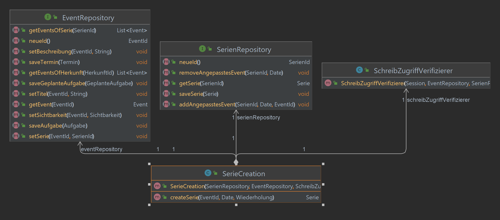
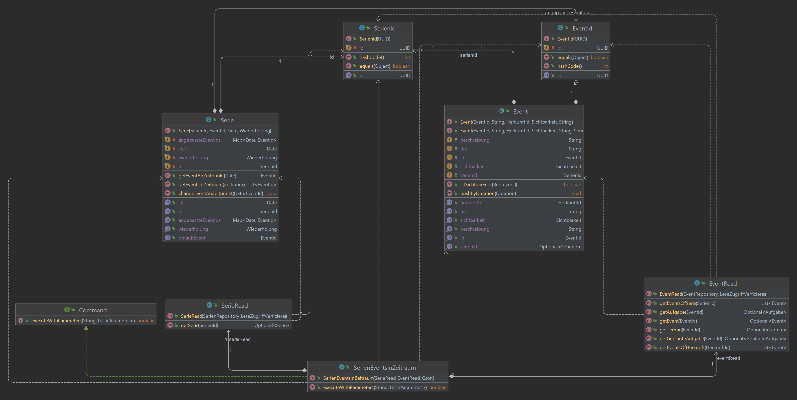
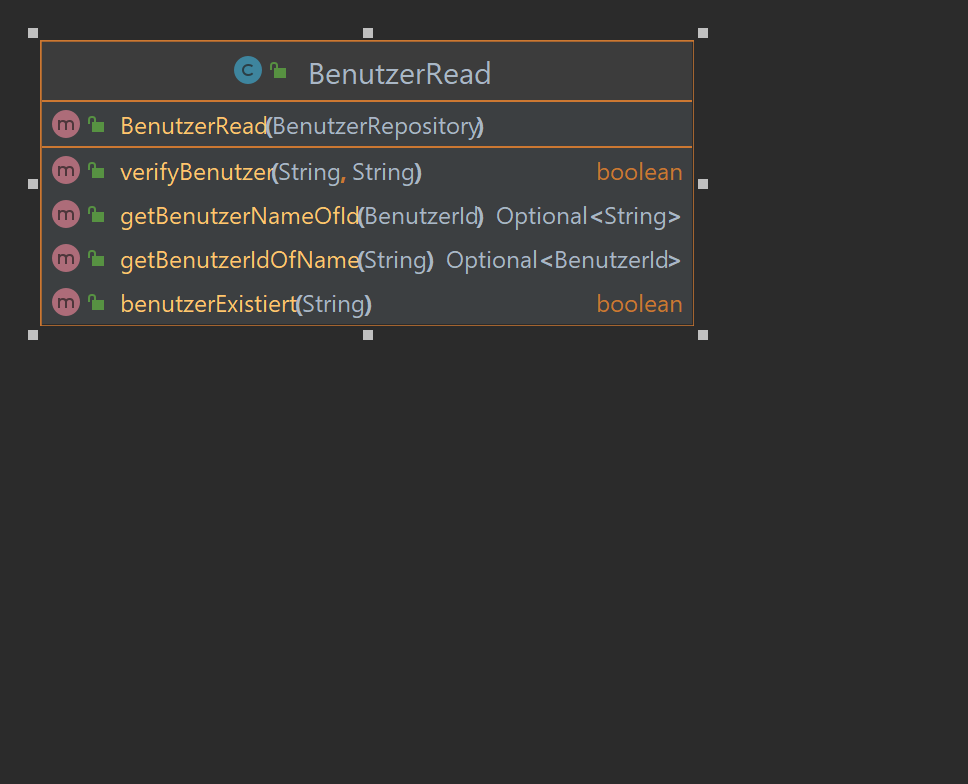
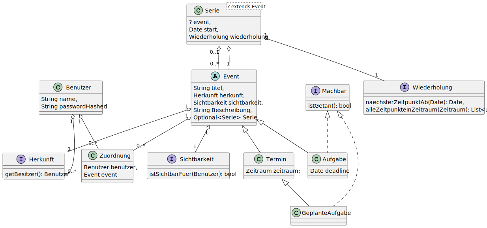
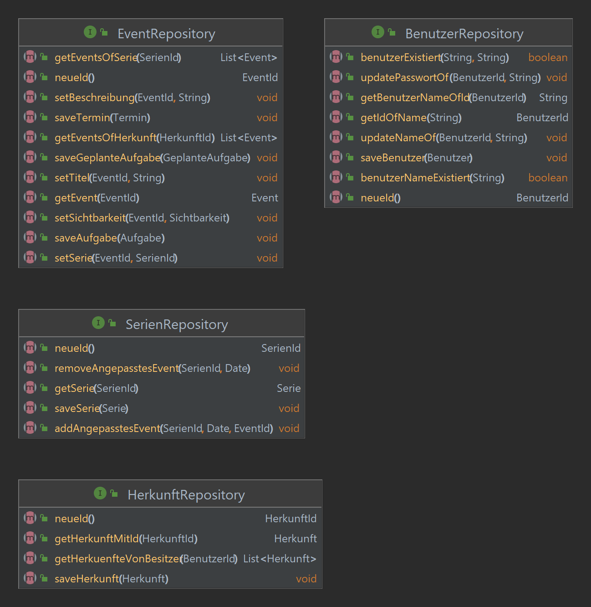
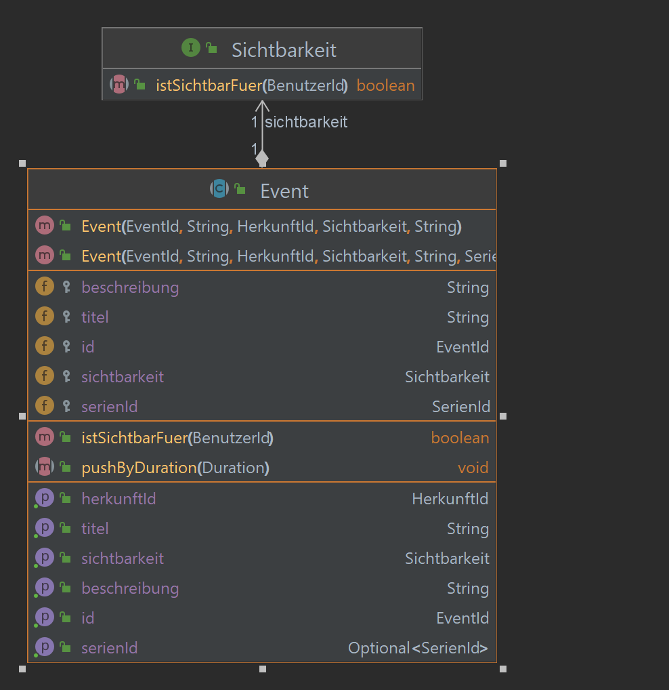
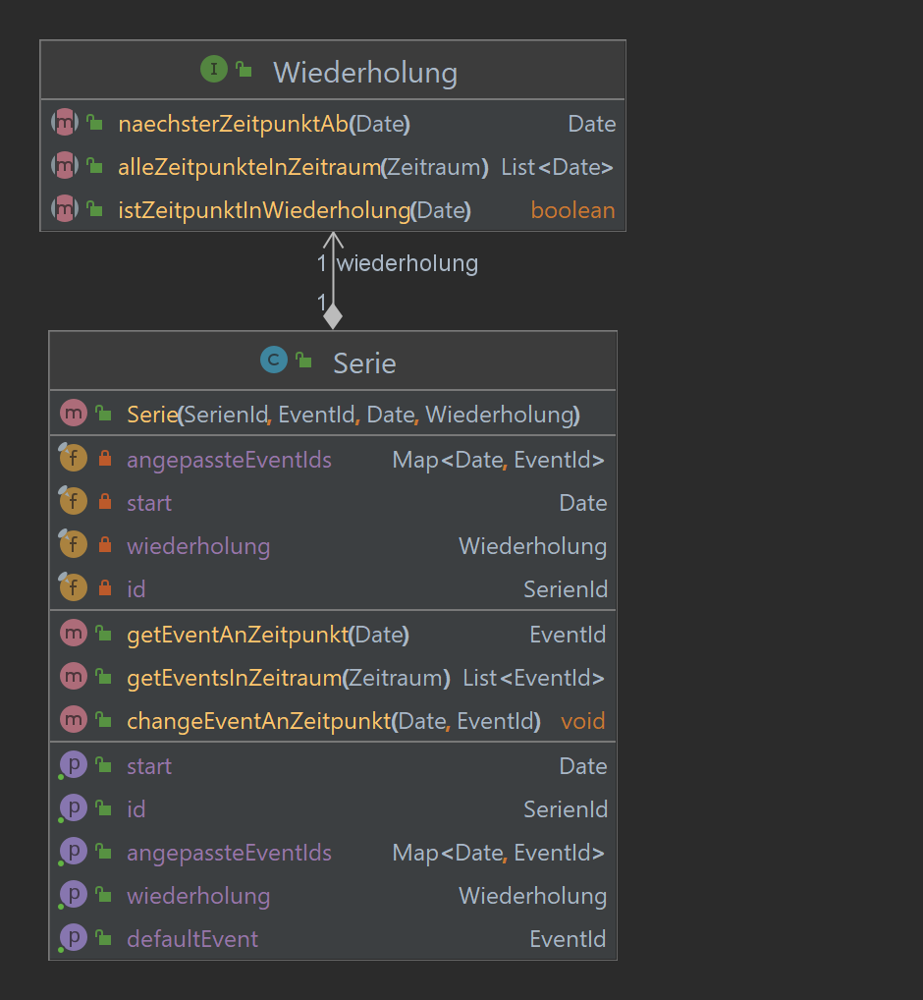
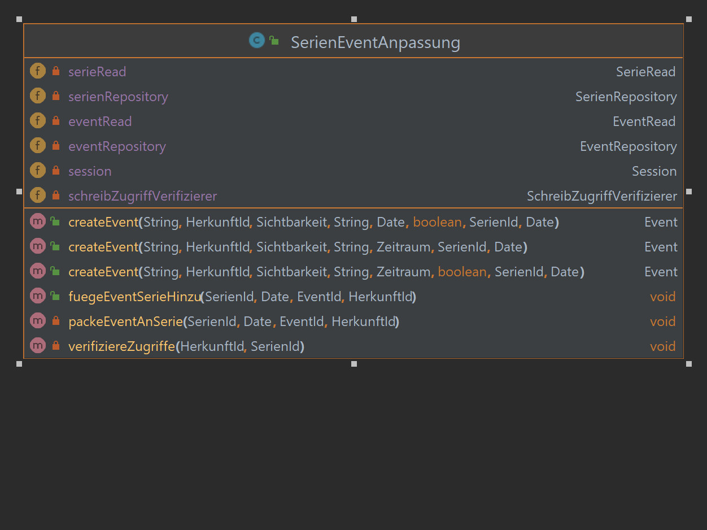
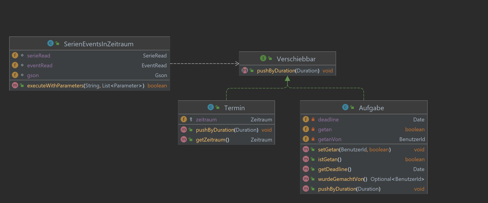
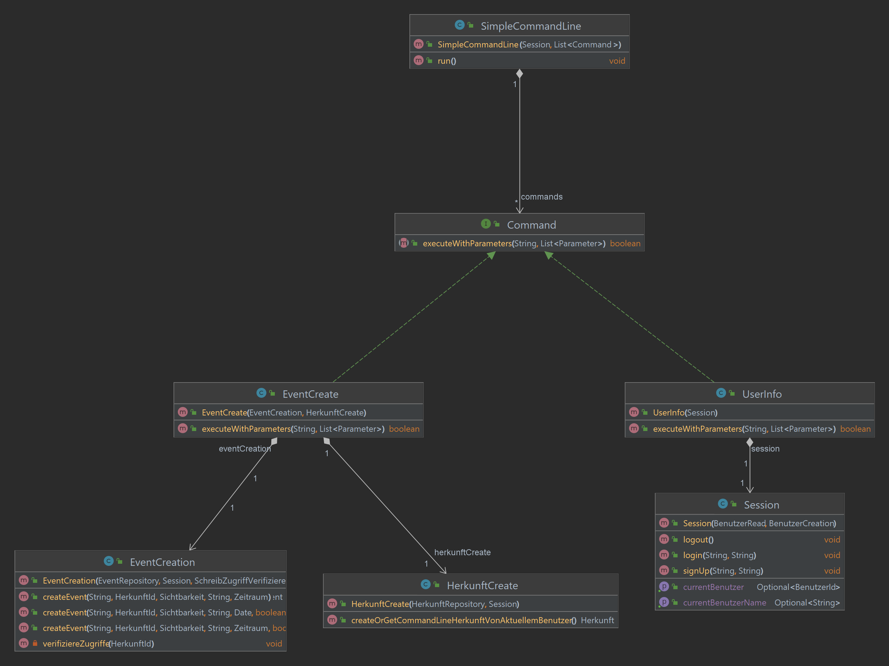

# Programmentwurf
# Kalendario

Name: Debbrecht, Lars
Matrikelnummer: 5714794

Abgabedatum: 

# Kapitel 1: Einführung

## Übersicht über die Applikation
[Was macht die Applikation? Wie funktioniert sie? Welches Problem löst sie/welchen Zweck hat sie?]
Die Applikation ist ein einfacher Kalender, der Events und Serien von Events speichert und wieder ausgeben kann. Sie hat die Möglichekeit dies für mehrere Benutzer zu tun, sodass jeder Benutzer seine eigene Events hat. Das anschauen von Events anderer Benutzer ist möglich, wenn dessen Event Ids bekannt sind.

## Wie startet man die Applikation
[Wie startet man die Applikation? Welche Voraussetzungen werden benötigt? Schritt-für-Schritt-Anleitung]
Benötigte Libraries: 
google.code.gson
xerial.sqlite.jdbc
Starten durch laufen lassen der Main Klasse.

## Wie testet man die Applikation?
[Wie testet man die Applikation? Welche Voraussetzungen werden benötigt? Schritt-für-Schritt-Anleitung]
Benötigte Libraries:
junit.jupiter
mockito.core
Laufen lassen aller Tests in src/test directory

# Kapitel 2: Clean Architecture

## Was ist Clean Architecture?
[allgemeine Beschreibung der Clean Architecture in eigenen Worten]
Clean Architecture ist eine Art guideline für die Architektur einer Software Applikation. Sie soll dabei helfen ein Programm verständlicher, einfacher, übersichtlicher, Änderungen einfacher und im ganzen Wartbarer zu machen. 
Dabei setzt Clean Architecture auf die Definition von Schichten, die jeweils eine eindeutig definierte Aufgabe haben. Dabei ist wichtig, dass die Schichten jeweils nur ihre eigene Aufgabe erfüllen und voneinander unabhängig sind.
Schichten weiter außen sind dabei austauschbarer und innere Schichten sind der Kern der Applikation, wo die wichtigste Logik implementiert ist. Diese soll so sich so wenig wie möglich ändern.

## Analyse der Dependency Rule
[(1 Klasse, die die Dependency Rule einhält und eine Klasse, die die Dependency Rule verletzt);   jeweils UML der Klasse und Analyse der Abhängigkeiten in beide Richtungen (d.h., von wem hängt die Klasse ab und wer hängt von der Klasse ab) in Bezug auf die Dependency Rule]

### Positiv-Beispiel: Dependency Rule

EventRead hängt von folgenden Klassen der Domain Schicht ab:
- EventRepository
- Termin
- GeplanteAufgabe
- Aufgabe
- HerkunftId
- Event
- SerienId

EventRead hängt von folgenden Klassen der Application Schicht ab:
- LeseZugriffVerifizierer

EventRead hängt von keinen Klassen der Plugin Schicht ab

Keine Klassen der Domain Schicht hängen von EventRead ab

Folgende Klassen der Application Schicht hängen von EventRead ab:
- SerienEventAnpassung
- EventUpdate

Folgende Klassen der Plugin Schicht hängen von EventRead ab:
- AlleEventsVonHier
- EventInfo
- SerienEventsInZeitraum

Da sich EventRead in der Application Schicht befindet ist somit die Dependency Rule erfüllt

### Negativ-Beispiel: Dependency Rule
Es gibt keine negativ Beispiele, da strikt erst Domain Layer, dann Application Layer und zuletzt Plugin Layer programmiert wurde. Daher hier ein weiteres Positiv Beispiel:

PasswortHasher hängt von keinen Klassen ab (Ausgenommen MessageDigest, was eine Standartbibliothek aus java.security ist)

Von PasswortHasher hängen Login und Signup ab. Beide sind Klassen in der Plugin Schicht.
Da PasswortHasher in der Domain Schicht definiert ist, ist damit die Dependency Rule erfüllt.

## Analyse der Schichten
[jeweils 1 Klasse zu 2 unterschiedlichen Schichten der Clean-Architecture: jeweils UML der Klasse (ggf. auch zusammenspielenden Klassen), Beschreibung der Aufgabe, Einordnung mit Begründung in die Clean-Architecture]
### Schicht: Domain
Die Domain Schicht definiert die für die Applikation notwendigen Entities, Value Objects und Repositories für diese.
Beispielklasse: Benutzer

Der Benutzer ist eine Klasse die einen User der Applikation repräsentiert. Er ist die Entity für den Benutzer. Er hält Eigenschaften des Users, wie Name und Passwort. Er ist eindeutig über seine Id identifiziert, da sich der Name ändern kann. 
Da es sich hierbei um eine Entity handelt, wird der Benutzer der Domain Schicht zugeteilt.

### Schicht: Application
In der Application Schicht werden UseCases implementiert. Besonders Verhalten über Aggregatgrenzen hinaus werden hier beachtet und bearbeitet. 
Sichtbarkeiten werden verifiziert und Interaktionen zwischen Event und Serie kontrolliert, sodass es zu keinen inkonsistenten Zuständen kommtn.
Beispielklasse: SerienEventAnpassung

Die SerienEventAnpassung fügt Serien neue Events zu, die andere Attribute haben als die des Serien Defaults. So kann ein Benutzer einzelne Events in einer Serie bearbeiten. Dies ist z.B. nützlich, wenn ein Termin der jede Woche auftritt an einem Tag verschoben wurde, aber in sonstigen Wochen gleich bleibt.
SerieneEventAnpassung koordiniert das Zusammenspiel vieler Klassen und delegiert an diese die einzelnen zwischenschritte. 
Session und Zugriffverifizierer werden genutzt, um zu überprüfen, ob der aktuelle Benutzer überhaupt das Recht hat eine solche Operation auszuführen.
SerienRead und EventRead werden genutzt, um die Entities sicher von der Datenbank zu holen, um Sie zu überprüfen.
Ob das Einfügen des Events in die Serie überhaupt möglich ist überprüft die Serie selbst.
Wenn alles gültig ist, werden die Änderungen über die EventRepository und SerienRepository geschrieben.

Da es sich hier um die Koordination eines UseCases handelt, ist die Klasse SerienEventRepository in der Application Schicht.

# Kapitel 3: SOLID

## Analyse Single-Responsibility-Principle (SRP)
[jeweils eine Klasse als positives und negatives Beispiel für SRP;  jeweils UML der Klasse und Beschreibung der Aufgabe bzw. der Aufgaben und möglicher Lösungsweg des Negativ-Beispiels (inkl. UML)]
### Positiv-Beispiel
Session: einzige Aufgabe ist den aktuell angemeldeten Benutzer zu tracken. Es gibt keine weiteren Aufgaben zum speichern, Zugriffe verifizieren oder ähnliches.
### Negativ-Beispiel
SimpleCommandLine: Diese Klasse übernimmt das Parsen eines vom Benutzer eingegebenen Strings, übernimmt teilweise die Ausgabe bei auftretenden fehlern, übernimmt das Aufrufen der Commands und übernimmt die Loop für den Gesamtablauf der Applikation.
Damit ist sie sehr überladen. Dies kann einfach refactored werden, indem die einzelnen Aufgabe in eine einzelne Klasse verschoben werden.

## Analyse Open-Closed-Principle (OCP)
[jeweils eine Klasse als positives und negatives Beispiel für OCP;  jeweils UML der Klasse und Analyse mit Begründung, warum das OCP erfüllt/nicht erfüllt wurde – falls erfüllt: warum hier sinnvoll/welches Problem gab es? Falls nicht erfüllt: wie könnte man es lösen (inkl. UML)?]
### Positiv-Beispiel
SimpleCommandLine: Weitere Commands können ohne weiteres durch das erweitern der Command List des Konstruktors erweitert werden. So ist die CommandLine um weitere Commands erweiterbar ohne Modifikationen am Code der Command List vornehmen zu müssen.
### Negativ-Beispiel
EventCreate ist nicht offen für weitere Subtypen von Events. Stattdessen muss ein neuer Event-Subtyp neue Methoden in der EventCreate Klasse bekommen, damit solche neuen Subtypen durch EventCreate erstellt werden können.

## Analyse Liskov-Substitution- (LSP), Interface-Segreggation- (ISP), Dependency-Inversion-Principle (DIP)
[jeweils eine Klasse als positives und negatives Beispiel für entweder LSP oder ISP oder DIP);  jeweils UML der Klasse und Begründung, warum man hier das Prinzip erfüllt/nicht erfüllt wird]
[Anm.: es darf nur ein Prinzip ausgewählt werden; es darf NICHT z.B. ein positives Beispiel für LSP und ein negatives Beispiel für ISP genommen werden]
## Interface-Segreggation Principle
### Positiv-Beispiel
Machbar ist ein Positivbeispiel. Hier werden nur Methoden verlangt, die auch tatsächlich verwendet werden müssen um etwas "Machbar" zu machen. Nämlich das setzen der gemacht-Eigenschaft und das Abfragen dieser, sowie des Benutzers der diese gesetzt hat.
### Negativ-Beispiel
EventRepository: Read, Create, Update in einem.
ISP wird nicht erfüllt um einen einziges Interface zum implementieren zu haben, an dass die Datenbanken angebunden werden können ohne verschiedenste Implementationen bieten zu müssen.
So nutzt EventRead z.B. nur ein Teilset der Methoden, EventCreation ein anderes. Dies wurde bewusst so gemacht, um die Datenbankanbindung an einem einzigen Ort machen zu können.


# Kapitel 4: Weitere Prinzipien

## Analyse GRASP: Geringe Kopplung
[jeweils eine bis jetzt noch nicht behandelte Klasse als positives und negatives Beispiel geringer Kopplung; jeweils UML Diagramm mit zusammenspielenden Klassen, Aufgabenbeschreibung und Begründung für die Umsetzung der geringen Kopplung bzw. Beschreibung, wie die Kopplung aufgelöst werden kann]
### Positiv-Beispiel

SerieCreation ist die Klasse für den UseCase: Der Nutzer möchte eine Serie aus einem Event erstellen können.
Hierfür ist sowohl notwendig eine Serie zu erstellen, als auch das Event, aus dem die Serie erstellt wurde zu verändern. Darüber hinaus muss überprüft werden, ob der Benutzer dies machen darf, indem der Schreibzugriff des Nutzers auf das Event getestet wird.

Geringe Kopplung wird dadurch erreicht, dass die Repositories zum Speichern der Änderungen nur Interfaces sind, also Implementationsänderungen an diesen keinen EInfluss auf SerieCreation haben.
Zudem wird die Überprüfung des Schreibzugriffs komplett an den mitgegebenen Schreibzugriffverifizierer abgegeben. Damit sind auch Änderungen an der Art wie Schreibzugriff verifiziert wird, ohne Einfluss auf diese Klasse.
Damit wird maximale Wiederverwendbarkeit garantiert. Andere Usecases, die eine Serie erstellen müssen, können einfach SerieCreation dazu benutzen, um sich nicht um die Einzelheiten, die dazu notwendig sind kümmern zu müssen.

### Negativ-Beispiel

SerienEventsInZeitraum ist ein Command, der die Events einer Serie in einem bestimmten Zeitraum ausgibt.
Hierzu muss er sich auf Implementationsdetails und Zusammenhänge zwischen Event, Serie, SerieRead und EventRead verlassen.
Damit steigt die Kopplung sehr stark. Die Kopplung kann aufgelöst werden, indem das Zusammenspiel in einen Usecase im Application Layer verschoben wird, wo die Events einer Serie in einem Zeitraum sinnvoll zusammengefügt werden. Dann ist der Command nur noch von diesem Usecase abhängig. Der Usecase wiederum kann dann eventuell in mehrere Usecases aufgeteilt werden, um weitere Abhängigkeiten aufzulösen.

## Analyse GRASP: Hohe Kohäsion
[eine Klasse als positives Beispiel hoher Kohäsion; UML Diagramm und Begründung, warum die Kohäsion hoch ist]

BenutzerRead hat ausschließlich Aufgaben zum Lesen von Benutzerdaten und keine weiteren Aufgaben. Damit ist die Kohäsion hoch, da das Objekt sehr fokussiert und somit einfach zu handhaben und verstehen ist.

## Don’t Repeat Yourself (DRY)
[ein Commit angeben, bei dem duplizierter Code/duplizierte Logik aufgelöst wurde; Code-Beispiele (vorher/nachher); begründen und Auswirkung beschreiben]
Commit: d06ec9746d9f5c88c1a347ff62ac49ba3fd0a944
Sowohl LesezugriffVerifizierer als auch SchreibzugriffVerifizierer hatten folgende Methoden:

```
private boolean currentBenutzerIstBesitzerVon(Event event) throws KeinZugriffException {
    Herkunft herkunft = herkunftRepository.getHerkunftWithId(event.getHerkunftId());
    if(herkunft == null) {
        throw new KeinZugriffException();
    }
    return herkunft.getBesitzerId().equals(getCurrentBenutzerOrThrow());
}

private BenutzerId getCurrentBenutzerOrThrow() throws KeinZugriffException{
    return session.getCurrentBenutzer().orElseThrow(KeinZugriffException::new);
}

private void nullCheck(Object o) throws KeinZugriffException{
    if(o == null){
        throw new KeinZugriffException();
    }
}
```
Dies wurde geändert indem das Interface ZugriffVerifizierer zu einer abstrakten Klasse Methode gemacht wurde,
die beide Methoden als protected definiert, sodass beide Klassen diese nicht einzeln definieren müssen und Änderungen an diesen an einem Ort stattfinden können-
In den folgenden Commits wurde hier weiter Refactored, sodass auch die übrigen Methoden nicht mehr abstract in der Klasse ZugriffVerifizierer
definiert sind, sondern dort Standartimplementationen definiert werden, die Predicates (die in den Konstuktoren der beiden Subklassen definiert werden und so das Verhalten der Klasse definieren) nutzen.


# Kapitel 5: Unit Tests
## 10 Unit Tests
[Nennung von 10 Unit-Tests und Beschreibung, was getestet wird]

| Unit Test                                                                                   | Beschreibung                                                                                                                                                                    |
|---------------------------------------------------------------------------------------------|---------------------------------------------------------------------------------------------------------------------------------------------------------------------------------|
| SerieCreationTest#createSerieSollSchreibZugriffVerifizieren                                 | Bei der Erstellung einer Serie muss zunächst getestet werden, ob der Benutzer eine Solche Serie erstellen darf, daher wird das Aufrufen der Methode verifiziert                 |
| SerieCreationTest#createSerieSollExceptionWerfenWennSerienRepositoryFehlerWirft             | Wenn bei der Erstellung einer Serie auf der Repository ettwas fehlschlägt, soll dieses weitergegeben werden                                                                     |
| SerieCreationTest#createSerieSollAlleUebergebenenEigenschaftenSpeichern                     | Bei der Erstellung einer Serie wird verifiziert, dass das Ergebnis des Speichervorgangs zu den mitgegebenen Daten passt                                                         |
| SerieTest#changeEventAnZeitpunktSollIllegalArgumentExceptionWerfenWennZeitpunktNichtInSerie | Diese Methode verifiziert, dass Events, die einer Serie hinzugefügt werden, aber nicht in diese Serie passen, nicht in die Serie gespiechert werden.                            |
| SerieTest#getEventsInZeitraumSollFuerJedenZeitpunktInWiederholungEinEventZurueckgeben       | Hier wird verifiziert, dass die Serie die korrekte Anzahl an Events zurückgibt, wenn sie einen Zeitraum bekommt, von dem sie Events zurückgeben soll                            |
| SerieTest#getEventInZeitraumSollExceptionWerfenWennZeitraumVorStart                         | Hier wird die Integritätsbedingung kontrolliert, nach der der Start der Serie das erste Vorkommen eines Events in der Serie ist und die Abfrage nach Events vorher ungültig ist |
| PrivateSichtbarkeitTest#istSichtbarFuerSollTrueZurueckgebenFuerAlleErlaubtenBenutzer        | Hier wird getestet, dass erlaubte Benutzer auch als solche von der PrivateSichtbarkeit erkannt werden                                                                           |
| PrivateSichtbarkeitTest#istSichtbarFuerSollFalseZurueckgebenFuerAlleUnerlaubtenBenutzer     | Hier wird das Gegenstück des oberen Falles getestet, dass ein unerlaubter Benutzer auch als solcher markiert wird.                                                              |
| ZeitraumTest#invaliderZeitraumSollExceptionWerfen                                           | Dieser Test testet die Integrität beim erstellen eines Zeitraums, der Start eines Zeitraums muss immer vor dessen Ende sein                                                     |
| ZeitraumTest#pushByDurationSollZeitraumMitBeidenDatenVerschobenGeben                        | Hier wird die pushBeiDuration Methode getestet, ein Verschobener Zeitraum soll Start und Ende um die angegebene Duration verschieben                                            |


## ATRIP: Automatic
[Begründung/Erläuterung, wie ‘Automatic’ realisiert wurde]
Alle Tests laufen mit JUnit und Mockito. Alle Tests haben automatische Initialisierung, für das Testen der Datenbank wird automatisch eine Datenbank erstellt und nach Abschluss der Tests wieder gelöscht.
Es ist dadurch keine Eingreifen des Nutzers beim Lauf der Tests notwendig

## ATRIP: Thorough
[jeweils 1 positives und negatives Beispiel zu ‘Thorough’; jeweils Code-Beispiel, Analyse und Begründung, was professionell/nicht professionell ist]
Positivbeispiel:

EventReadTest: Hier wurden sowohl alle gewollten Ausgaben getestet, als auch alle Verhalten in Fehlerfällen (z.B. was gemacht werden soll, wenn Exceptions ausgelöst werden)

Negativbeispiel:

Repository Tests: Hier wurden keine Unit Tests erstellt, sondern ausschließlich Integration Tests. Diese testen auch nur die Fälle, in denen alles gut läuft, und nicht ausgiebig, was in Fehlerfällen (z.B. SQLException von der Datenbank) passieren soll.

## ATRIP: Professional
[jeweils 1 positives und negatives Beispiel zu ‘Professional’; jeweils Code-Beispiel, Analyse und Begründung, was professionell/nicht professionell ist]
Positivbeispiel:

BenutzerUpdateTest: Hier wird Code durch die Nutzung einer Init Methode wiederverwendet, das einstellen von Mocks wird nicht in jeder Methode wieder gemacht. Es werden keine unnötigen Tests geschriben und alle Testfälle gamz eindeutig und unabhängig voneinander definiert.

Negativbeispiel:

EventCreationTest: Hier werden immer wieder dieselben Mocks gleich eingestellt, es gibt viel Code replication und mögliche Nutzung von Polymorphie wurde ignoriert. Viele Code Smells. 

## Code Coverage
[Code Coverage im Projekt analysieren und begründen]
Code Coverage insbesondere in Domain Layer nahe 100%. Die wichtigsten Funktionalitäten sind hier definiert und sollten auch funktionieren. Nur generierte Methoden wie z.B. Hashcode sind nicht getestet.
Im Application Layer ist die Code Coverage bei ca. 80%. Alle Happy Paths sind getestet, sowie die komplizierten Möglichkeiten von Fehlschägen. 
Im Plugin Layer sind die Repositories nur mit Integration Tests in Happy Paths getestet, die CLI ist nicht automatisch getestet. Dies liegt daran, dass die Codemenge die Anforderungen zum Implementationszeitpunkt der CLI bereits erreicht hat und der Fokus der Applikation auf die Korrektheit in den Inneren Layern liegen soll, daher ist die CLI eher trivial implementiert und ungetestet.
Da die CLI auch beliebig ausgetauscht werden kann und dann neue automatische Tests notwendig sind, ist das manuelle Testen ausreichend.

## Fakes und Mocks
[Analyse und Begründung des Einsatzes von 2 Fake/Mock-Objekten; zusätzlich jeweils UML Diagramm der Klasse]
SerieCreationTest: Nutzung von Mocks für alle Dependecies, da im EventTest nur die Funktionalität von der Klasse Event getestet werden soll, alle anderen Dependencies werden gemockt. Diese Dependencies werden in anderen Testklassen getestet.

So kann zum Beispiel beim schreiben einer Serie auf die Repository eine Exception hervorgerufen werden, um den Fehlerfall zu testen. (createSerieSollSerieBeiDefaultEventRollbackenWennSerienSaveFehlschlaegt)

Und es kann verifiziert werden, dass der Schreibzugriff getestet wurde, indem der Aufruf der Methode verifiziert wird (createSerieSollSchreibZugriffVerifizieren)


# Kapitel 6: Domain Driven Design

## Ubiquitous Language
[4 Beispiele für die Ubiquitous Language; jeweils Bezeichung, Bedeutung und kurze Begründung, warum es zur Ubiquitous Language gehört]

| Bezeichnung | Bedeutung                                                               | Begründung                                                                                                                                       |
|-------------|-------------------------------------------------------------------------|--------------------------------------------------------------------------------------------------------------------------------------------------|
| Event       | Überbegriff für im Kalendar anzeigbare Items                            | Event hier anders Benutzt als typischerweise im Programmierkontext, hier wird Begriff stattdessen aus Domainkontext genommen                     |
| Serie       | Menge an Events, die alle durch Wiederholung desselben Events entstehen | Wiederholbare Events, wie z.B. Geburtstage jedes Jahr, sollen so von normalen Events unterschieden werden                                        |
| Geplant     | Solche Events, die in einem bestimmten (geplanten) Zeitraum stattfinden | Unterscheidung von Events mit festem Start und Endzeitpunkt von anderen                                                                          |
| Besitzer    | Derjenige Benutzer, der ein Event erstellt hat, ist dessen Besitzer     | Klare Definition um zu sehen, wem ein Event gehört                                                                                               |
| Herkunft    | Ort/Programm/quelle an dem ein Event oder eine Serie erstellt wurde     | Das Programm soll Events aus mehreren Quellen zusammenführen. Damit klar ist wie ein Event entstanden ist, wird die Herkunft des Events benötigt |

## Entities
[UML, Beschreibung und Begründung des Einsatzes einer Entity; falls keine Entity vorhanden: ausführliche Begründung, warum es keines geben kann/hier nicht sinnvoll ist]


## Value Objects
[UML, Beschreibung und Begründung des Einsatzes eines Value Objects; falls kein Value Object vorhanden: ausführliche Begründung, warum es keines geben kann/hier nicht sinnvoll ist]

Nur Zeitraum, der einen Zeitraum zwischen einem Date Start und einem Date Ende beschreibt. 
Wird benötigt um feste Regeln einfacher zu machen, die sonst an vielen Stellen kontrolliert werden müssten (Start muss vor Ende sein)
Zeitraum ist ein Wert in der Domäne, so Semantik definierbar.

## Repositories
[UML, Beschreibung und Begründung des Einsatzes eines Repositories; falls kein Repository vorhanden: ausführliche Begründung, warum es keines geben kann/hier nicht sinnvoll ist]
Für jedes Aggregat Root Entity in der Domain Schicht wurde eine einzelne Repository erstellt:



## Aggregates
[UML, Beschreibung und Begründung des Einsatzes eines Aggregates; falls kein Aggregate vorhanden: ausführliche Begründung, warum es keines geben kann/hier nicht sinnvoll ist]
Event zum Zugriff auf Sichbarkeit:

Die Sichtbarkeit eines Events ist zentraler Bestandteils dessen. Ohne die Sichtbarkeit eines Events zu kennen ist nicht klar, ob das Event für einen Benutzer angezeigt werden darf. 
Daher ist die Sichtbarkeit stark an das Event gekoppelt und so zum Aggregat mit dem Event. Event ist aber immer noch der Zentrale Anlaufpunkt, da es das Hauptobjekt der Domäne darstellt, daher ist Event die Aggregate-Root-Entity.

Serie zum Zugriff auf Wiederholung:

Die Wiederholung einer Serie ist offensichtlich essentiell für die Serie. Mit dieser bestimmt die Serie an welchen Zeitpunkten Events stattfinden. Daher ist Wiederholung ein Bestandteil des Serien Aggregats.

# Kapitel 7: Refactoring

## Code Smells
[jeweils 1 Code-Beispiel zu 2 Code Smells aus der Vorlesung; jeweils Code-Beispiel und einen möglichen Lösungsweg bzw. den genommen Lösungsweg beschreiben (inkl. (Pseudo-)Code)]
Code Smell 1: Long Method: EventRepositorySQLite#getEventFromResultSet(ResultSet resultsEvent)
```
private Event getEventFromResultSet(ResultSet resultsEvent) throws SQLException {
    EventId eventId = new EventId(UUID.fromString(resultsEvent.getString("EventId")));
    String titel = resultsEvent.getString("Titel");
    HerkunftId herkunft = new HerkunftId(UUID.fromString(resultsEvent.getString("HerkunftId")));
    Sichtbarkeit sichtbarkeit;
    if(resultsEvent.getString("Sichtbarkeit").equals(SICHTBARKEIT_PUBLIC)){
        sichtbarkeit = new PublicSichtbarkeit();
    }else{
        sichtbarkeit = getPrivateSichtbarkeit(eventId);
    }
    String beschreibung = resultsEvent.getString("Beschreibung");
    String serienIdStr = resultsEvent.getString("SerienId");
    SerienId serienId;
    try{
        serienId = new SerienId(UUID.fromString(serienIdStr));
    }catch(IllegalArgumentException | NullPointerException e){
        serienId = null;
    }
    switch (resultsEvent.getString("Typ")){
        case TYP_TERMIN -> {
            Zeitraum zeitraum = getZeitraum(eventId);
            return new Termin(eventId, titel, herkunft, sichtbarkeit, beschreibung, serienId, zeitraum);
        }
        case TYP_AUFGABE -> {
            Machbar machbar = getMachbar(eventId);
            Date deadline = getDeadline(eventId);
            Aufgabe aufgabe = new Aufgabe(eventId, titel, herkunft, sichtbarkeit, beschreibung, serienId, deadline);
            if(machbar.istGetan()){
                aufgabe.setGetan(machbar.wurdeGemachtVon().get(), machbar.istGetan());
            }
            return aufgabe;
        }
        case TYP_GEPLANTE_AUFGABE ->{
            Machbar machbar = getMachbar(eventId);
            Zeitraum zeitraum = getZeitraum(eventId);
            GeplanteAufgabe geplanteAufgabe = new GeplanteAufgabe(eventId, titel, herkunft, sichtbarkeit, beschreibung, serienId, zeitraum);
            if(machbar.istGetan()){
                geplanteAufgabe.setGetan(machbar.wurdeGemachtVon().get(), machbar.istGetan());
            }
            return geplanteAufgabe;
        }
    }
    return null;
}
```
Viel zu lange Methode. Stattdessen könnte das herausfiltern der einzelnen Attribute aus dem Resultset in eigene Methoden gepackt werden. Bsp. für Sichtbarkeit:
```
private Sichtbarkeit fromResultSet(ResultSet resultset){
    if(resultsEvent.getString("Sichtbarkeit").equals(SICHTBARKEIT_PUBLIC)){
        return new PublicSichtbarkeit();
    }else{
        return getPrivateSichtbarkeit(eventId);
    }
}
```

und dann in getEventFromResultSet:
```
...
Sichtbarkeit sichtbarkeit = fromResultSet(resultsEvent);
...
```
ebenso kann versucht werden die Aufrufe in dem langen switch-case in einzelne Methoden auszulagern.

Code Smell 2: Large Class: auch EventRepositorySQLite
Viele Methoden zum speichern, ändern und lesen, dazu viele Hilfmethoden, die die Vorgänge verienfachen.
Hier können Verantwortlichkeiten aufgeteilt werden. Durch die Anwendung des Interface Segregation Principles könnte das EventRepsository Interace in mehrere aufgeteilt werden (z.B. in Create, Read, Update und Delete).
Desweiteren können gemeinsame Methoden (z.B. zum initialisieren der Tabellen) können beispielsweise in Helfer-Klassen ausgelagert werden.
Durch diesen Vorgang können die vielen Aufgaben und Helfermethoden in mehrere Klassen aufgeteilt werden:


## 2 Refactorings
[2 unterschiedliche Refactorings aus der Vorlesung anwenden, begründen, sowie UML vorher/nachher liefern; jeweils auf die Commits verweisen]

Refactoring 1: Extract Method: Wiederholte nullchecks in Methode ausgelagert. Commit 1e4b0370f9bb7d64ca6d1db995af87404035802d

Kein Einfluss auf UML, da nur Methodenimplementationen sich verändert haben, stattdessen hier Codebeispiel:
Vorher:
```
public void verifiziereZugriffFuerSerie(SerienId serienId) throws KeinZugriffException{
    Serie serie = serienRepository.getSerie(serienId);
    if(serie == null){
        throw new KeinZugriffException();
    }
    verifiziereZugriffFuerSerie(serie);
}
...
public void verifiziereZugriffFuerSerie(SerienId serienId) throws KeinZugriffException{
    Serie serie = serienRepository.getSerie(serienId);
    if(serie == null){
        throw new KeinZugriffException();
    }
    verifiziereZugriffFuerSerie(serie);
}
...
private boolean currentBenutzerIstBesitzerVon(Event event) throws KeinZugriffException {
    Herkunft herkunft = herkunftRepository.getHerkunftWithId(event.getHerkunftId());
    if(herkunft == null) {
        throw new KeinZugriffException();
    }
    return herkunft.getBesitzerId().equals(getCurrentBenutzerOrThrow());
}
...
```

Nachher:
```
public void verifiziereZugriffFuerSerie(SerienId serienId) throws KeinZugriffException{
    Serie serie = serienRepository.getSerie(serienId);
    nullCheck(serie);
    verifiziereZugriffFuerSerie(serie);
}
...
public void verifiziereZugriffFuerSerie(SerienId serienId) throws KeinZugriffException{
    Serie serie = serienRepository.getSerie(serienId);
    nullCheck(serie);
    verifiziereZugriffFuerSerie(serie);
}
...
private boolean currentBenutzerIstBesitzerVon(Event event) throws KeinZugriffException {
    Herkunft herkunft = herkunftRepository.getHerkunftWithId(event.getHerkunftId());
    nullCheck(serie);
    return herkunft.getBesitzerId().equals(getCurrentBenutzerOrThrow());
}
...
private void nullCheck(Object o) throws KeinZugriffException{
    if(o == null){
        throw new KeinZugriffException();
    }
}
...
```

Refactoring 2: Rename Method: In SerienEventAnpassung die Methodennamen genauer spezifiziert. Commit 6e8ebef996d6606c0d557ff2b152367021a91c1d:

Die Methoden in SerienEventAnpassung haben nur Events zurückgegeben und die Methodennamen haben das auch reflektiert. In Wirklichkeit hat die Methoden aber Subklassen des Events zurück gegeben. Die Methoden wurden umbenannt um dies zu reflektieren:
Vorher:

Nachher:


# Kapitel 8: Entwurfsmuster
[2 unterschiedliche Entwurfsmuster aus der Vorlesung (oder nach Absprache auch andere) jeweils sinnvoll einsetzen, begründen und UML-Diagramm]
## Entwurfsmuster: Strategie


Strategie hier eingesetzt, da das Verschieben von verschiedenen Events je nach Art unterschiedlich funktioniert (verschiedene Algorithmen). Bei Events mit Deadline muss nur die Deadline verschoben werden, bei Events mit Zeiträumen muss der gesamte Zeitraum verschoben werden.

## Entwurfsmuster: Kommando

Commando ist die Basisklasse für alle Kommandos. ALle Implementationen (in plugin.herkunft.simpleCommandLine.commands) sind konkrete Befehle, hier sind als Beispiel EvenCreate und UserInfo abgebildet.
Empfänger der Befehle sind die Usecase Klassen des Application Layers. Für UserInfo ist das die Session, für EventCreate sind das EventCreation und HerkunftCreation.
Der Klient, der die konkreten Befehle erzeugt und Verweise auf die Empfänger gibt ist in dieser Applikation die Main Klasse. Der Klient gibt dem Aufrufer auch die Referenzen auf die konkreten Befehle über eine Befehlsliste.